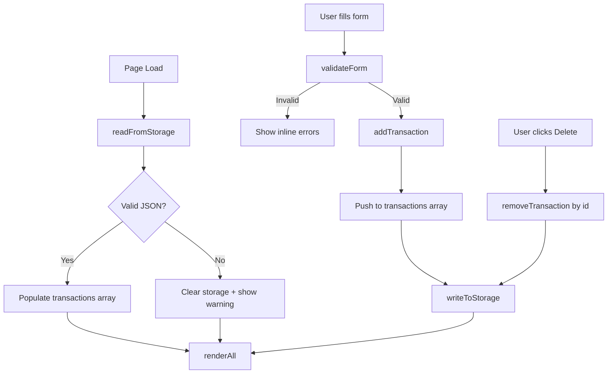

# Design Document

## Overview

The Expense & Budget Visualizer is a single-page, client-side web application built with pure HTML, CSS, and Vanilla JavaScript. It lets users record personal expense transactions, view a running balance, and see a pie chart of spending by category — all without a server or build toolchain.

All state is held in a single in-memory array and mirrored to `localStorage` under the key `"expense_transactions"`. Chart.js is loaded from a CDN and renders the pie chart inside a `<canvas>` element. The application targets the `file://` protocol, so there are no CORS concerns and no module system is used; everything runs as plain `<script>` tags.

Key design goals:
- **Zero dependencies installed locally** — only one CDN script (Chart.js).
- **Single-file JS** (`js/app.js`) that is easy to read and extend.
- **Fast perceived performance** — all UI updates happen synchronously within one render pass after each user action.
- **Accessibility-first** — semantic HTML, ARIA attributes, visible focus indicators, and `aria-live` regions for validation errors.

---

## Architecture

The application follows a simple **Event → State → Render** cycle with no framework:

```
User Action
    │
    ▼
Event Handler (js/app.js)
    │
    ├── Mutate in-memory state (transactions[])
    │
    ├── Persist to localStorage
    │
    └── Re-render affected UI regions
            ├── renderTransactionList()
            ├── renderBalance()
            └── renderChart()
```

There is no virtual DOM, no reactive data binding, and no component framework. Each render function reads directly from the global `transactions` array and writes to the DOM. This keeps the mental model simple: state is always in `transactions[]`, the DOM is a pure projection of that state.



### File Layout

```
index.html          ← single HTML page, references css/style.css and js/app.js
css/
  style.css         ← all styles (layout, theme, responsive, accessibility)
js/
  app.js            ← all application logic (state, validation, storage, rendering)
```

---

## Components and Interfaces

### HTML Structure (`index.html`)

```
<body>
  <header>
    <h1>Expense & Budget Visualizer</h1>
    <div id="balance-display">       ← Requirement 6
      <span id="balance-amount">$0.00</span>
    </div>
  </header>

  <main>
    <section id="form-section">      ← Requirement 2
      <form id="transaction-form">
        <div class="field-group">
          <label for="item-name">Item Name</label>
          <input id="item-name" type="text" maxlength="100" aria-required="true">
          <span class="error-msg" role="alert" aria-live="polite" id="error-item-name"></span>
        </div>
        <div class="field-group">
          <label for="amount">Amount</label>
          <input id="amount" type="number" min="0.01" max="999999999.99" step="0.01" aria-required="true">
          <span class="error-msg" role="alert" aria-live="polite" id="error-amount"></span>
        </div>
        <div class="field-group">
          <label for="category">Category</label>
          <select id="category" aria-required="true">
            <option value="" disabled selected>Select a category</option>
            <option value="Food">Food</option>
            <option value="Transport">Transport</option>
            <option value="Fun">Fun</option>
          </select>
          <span class="error-msg" role="alert" aria-live="polite" id="error-category"></span>
        </div>
        <button type="submit">Add Transaction</button>
      </form>
    </section>

    <section id="transactions-section">   ← Requirement 4
      <h2>Transactions</h2>
      <div id="transaction-list" role="list">
        <!-- populated by renderTransactionList() -->
      </div>
    </section>

    <section id="chart-section">          ← Requirement 7
      <h2>Spending by Category</h2>
      <div id="chart-container">
        <canvas id="spending-chart"></canvas>
        <p id="chart-placeholder" hidden>No data to display</p>
        <p id="chart-error" hidden>Chart could not be rendered (Chart.js failed to load).</p>
      </div>
    </section>
  </main>
</body>
```

### JavaScript Module: `js/app.js`

All logic lives in a single IIFE to avoid polluting the global scope while remaining compatible with the `file://` protocol (no ES modules).

#### Public-facing functions (called from event handlers)

| Function | Signature | Purpose |
|---|---|---|
| `init()` | `() → void` | Called on `DOMContentLoaded`; loads storage, renders UI |
| `addTransaction(name, amount, category)` | `(string, number, string) → Transaction` | Creates transaction object, pushes to array, persists, re-renders |
| `removeTransaction(id)` | `(string) → void` | Filters array, persists, re-renders |
| `validateForm(name, amount, category)` | `(string, string, string) → ValidationResult` | Returns `{valid: bool, errors: {name?, amount?, category?}}` |

#### Internal render functions

| Function | Purpose |
|---|---|
| `renderAll()` | Calls the three render functions below in sequence |
| `renderTransactionList()` | Rebuilds `#transaction-list` DOM from `transactions[]` |
| `renderBalance()` | Recalculates sum of all amounts, updates `#balance-amount` |
| `renderChart()` | Aggregates totals by category, calls `chart.update()` or creates new Chart instance |

#### Storage functions

| Function | Signature | Purpose |
|---|---|
| `readFromStorage()` | `() → Transaction[]` | Reads & parses `localStorage["expense_transactions"]`; returns `[]` on missing/corrupt data |
| `writeToStorage(list)` | `(Transaction[]) → void` | Serializes array to JSON and writes to localStorage |

#### Utility functions

| Function | Signature | Purpose |
|---|---|
| `generateId()` | `() → string` | Returns a unique ID string (timestamp + random suffix) |
| `formatCurrency(amount)` | `(number) → string` | Returns amount formatted as `"$1,234.56"` |
| `aggregateByCategory(list)` | `(Transaction[]) → CategoryMap` | Returns `{Food: n, Transport: n, Fun: n}` with only non-zero entries |

---

## Data Models

### `Transaction` object

```js
{
  id:       string,   // unique identifier, e.g. "1721234567890_abc123"
  name:     string,   // item name, 1–100 characters
  amount:   number,   // positive float, 0.01–999999999.99
  category: string    // "Food" | "Transport" | "Fun"
}
```

### `ValidationResult` object

```js
{
  valid: boolean,
  errors: {
    name?:     string,  // error message if name validation failed
    amount?:   string,  // error message if amount validation failed
    category?: string   // error message if category validation failed
  }
}
```

### `CategoryMap` object

```js
{
  // only keys with non-zero totals are present
  Food?:      number,
  Transport?: number,
  Fun?:       number
}
```

### Local Storage schema

- **Key**: `"expense_transactions"`
- **Value**: JSON-serialized array of `Transaction` objects
- **Example**:
  ```json
  [
    {"id":"1721234567890_abc123","name":"Lunch","amount":12.50,"category":"Food"},
    {"id":"1721234999000_xyz789","name":"Bus fare","amount":3.00,"category":"Transport"}
  ]
  ```

### Maximum transaction limit

- The application supports a maximum of **500** stored transactions (Requirement 9.3).
- When `transactions.length >= 500`, the Add button is disabled and a notification is shown.

### Category color mapping (Chart.js)

```js
const CATEGORY_COLORS = {
  Food:      '#FF6384',
  Transport: '#36A2EB',
  Fun:       '#FFCE56'
};
```

---

## Correctness Properties

*A property is a characteristic or behavior that should hold true across all valid executions of a system — essentially, a formal statement about what the system should do. Properties serve as the bridge between human-readable specifications and machine-verifiable correctness guarantees.*

### Property 1: Local Storage round-trip preserves transaction data

*For any* array of valid `Transaction` objects, serializing the array to Local Storage with `writeToStorage` and then reading it back with `readFromStorage` must produce an array that is deeply equal to the original — every `id`, `name`, `amount`, and `category` field must match exactly.

**Validates: Requirements 3.1, 3.2, 3.3**

---

### Property 2: Balance equals the arithmetic sum of all transaction amounts

*For any* array of `Transaction` objects (including an empty array), the value returned by `computeBalance` must equal the arithmetic sum of all `amount` fields, rounded to 2 decimal places. For an empty array the result must be `0.00`.

**Validates: Requirements 6.1, 6.2, 6.3, 6.4**

---

### Property 3: Validator rejects all invalid inputs

*For any* combination of inputs where at least one of the following is true — (a) the item name is empty or contains only whitespace characters, (b) the amount is not a finite number in the range `[0.01, 999999999.99]`, or (c) the category is not one of `"Food"`, `"Transport"`, `"Fun"` — `validateForm` must return `{valid: false}` with a non-empty error message for each failing field.

**Validates: Requirements 2.4, 2.5, 2.6, 2.7**

---

### Property 4: Chart aggregation is correct and excludes zero-total categories

*For any* array of `Transaction` objects, `aggregateByCategory` must return a map where (a) every present key's value equals the exact sum of `amount` fields for transactions of that category, and (b) no key is present whose sum is zero or less. Categories with no transactions must be absent from the result.

**Validates: Requirements 7.1, 7.4**

---

### Property 5: Adding a transaction inserts it at the head of the list

*For any* valid `Transaction` and any existing transaction array with fewer than 500 entries, calling `addTransaction` must produce a list whose length is exactly one greater than before, with the new transaction at index 0 and all previous entries shifted down by one position (most-recent-first order preserved).

**Validates: Requirements 4.3, 6.2, 9.3**

---

### Property 6: Deleting a transaction removes exactly that entry and leaves all others intact

*For any* transaction array containing at least one entry and *any* `id` present in that array, calling `removeTransaction(id)` must produce a list where (a) no entry has the given `id`, and (b) every entry that previously existed with a different `id` is still present with all its fields unchanged.

**Validates: Requirements 5.2, 4.4, 6.3**

---

## Error Handling

### Corrupt Local Storage data (Requirement 3.5)

- On load, `readFromStorage()` wraps `JSON.parse()` in a `try/catch`.
- If parsing fails, the function returns `[]` and sets a flag that causes a non-blocking warning banner to appear (e.g., a dismissible `<div role="alert">` at the top of the page).
- The corrupt entry is cleared from Local Storage so subsequent loads start clean.

### Chart.js CDN failure (Requirement 7.7)

- The `<script>` tag for Chart.js includes an `onerror` handler that sets a module-level flag `chartJsLoaded = false`.
- `renderChart()` checks this flag; if false, it hides the `<canvas>` and shows `#chart-error`.
- No further Chart.js calls are made, preventing runtime errors.

### 500-transaction limit (Requirement 9.3)

- Before adding a transaction, `addTransaction()` checks `transactions.length >= 500`.
- If the limit is reached, the Add button is disabled (`disabled` attribute), the form submit is short-circuited, and a notification paragraph is revealed near the form.
- No error is thrown; the application state remains valid.

### Invalid amount input

- `type="number"` on the input prevents most non-numeric keyboard entry in modern browsers.
- The `validateForm()` function uses `parseFloat()` and range checks as a second layer of defense, covering cases like copy-pasted invalid values or programmatic input.

---

## Testing Strategy

Because this application uses no build tools or test runner framework, and all logic runs in a browser context, formal automated testing is not part of the production setup. The correctness properties above define the behavioral contracts that are manually verified or exercised via a browser console harness.

### Why property-based testing is not run automatically

This project deliberately avoids a build toolchain (no Node.js, no npm, no bundler). The pure logic functions (`validateForm`, `aggregateByCategory`, `computeBalance`, `readFromStorage`/`writeToStorage`) are excellent candidates for property-based testing with a library such as [fast-check](https://github.com/dubzzz/fast-check), but running such a library requires a Node.js environment. The properties are therefore documented as behavioral contracts and verified manually.

If the project is ever extended with a test runner, each property maps to a single PBT test configured for at least 100 iterations:

| Property | PBT Test Idea | Validates |
|---|---|---|
| 1 — Storage round-trip | Generate random `Transaction[]`, serialize→deserialize, assert deep equal | 3.1, 3.2, 3.3 |
| 2 — Balance sum | Generate random `Transaction[]`, assert `computeBalance(list) === list.reduce((s,t)=>s+t.amount,0)` | 6.1–6.4 |
| 3 — Validator rejects invalid | Generate invalid name/amount/category combos, assert `validateForm(...).valid === false` | 2.4–2.7 |
| 4 — Chart aggregation | Generate random `Transaction[]`, assert `aggregateByCategory` sums match and zeros are absent | 7.1, 7.4 |
| 5 — Add inserts at head | Generate valid transaction + list < 500, assert `list.length +1` and `list[0] === newTx` | 4.3, 9.3 |
| 6 — Delete removes exactly one | Generate list with ≥1 entry, delete random id, assert no entry with that id and all others unchanged | 5.2, 4.4 |

### Manual Verification Checklist

**Form Validation (Property 3)**
- [ ] Submit with empty item name → inline error appears, transaction not added
- [ ] Submit with whitespace-only name (e.g., `"   "`) → inline error appears
- [ ] Submit with amount = 0 → inline error appears
- [ ] Submit with amount = -1 → inline error appears
- [ ] Submit with amount = 1000000000 (above max) → inline error appears
- [ ] Submit with no category selected → inline error appears
- [ ] Submit valid form → all errors clear, transaction added, form resets

**Local Storage Round-Trip (Property 1)**
- [ ] Add 3 transactions, reload page → all 3 reappear with correct name/amount/category
- [ ] Delete 1 transaction, reload page → only 2 transactions remain
- [ ] Manually set `localStorage["expense_transactions"] = "not json"`, reload → warning banner appears, list is empty, storage is cleared

**Balance Calculation (Property 2)**
- [ ] Add transactions of known amounts → balance matches manual sum
- [ ] Delete a transaction → balance updates to correct reduced total
- [ ] Empty list → balance shows `$0.00`

**Chart Aggregation (Property 4)**
- [ ] Add Food transactions only → only Food arc present in chart
- [ ] Add Transport + Fun → all three arcs present, proportional to totals
- [ ] Delete all Food transactions → Food arc disappears, remaining arcs re-proportion

**List Operations (Properties 5 & 6)**
- [ ] Add transaction → new entry appears at top of list
- [ ] Delete a transaction → that entry is removed, all others remain in correct order
- [ ] Add 500 transactions → 501st add attempt is blocked, notification is shown, list stays at 500

**Error & Edge Cases**
- [ ] Corrupt Local Storage (as above) → warning banner, empty state
- [ ] Block Chart.js CDN (DevTools network throttle) → `#chart-error` message appears
- [ ] Load with empty Local Storage → empty transaction list, balance `$0.00`, chart placeholder shown

**Accessibility**
- [ ] Tab through all controls → every element receives a visible focus indicator
- [ ] Submit invalid form → VoiceOver/NVDA announces error messages (aria-live regions fire)
- [ ] Keyboard-only: add and delete a transaction using only Tab / Enter / Space

**Responsiveness**
- [ ] Resize viewport to 320px wide → no horizontal scrollbar, all controls accessible
- [ ] Resize to 1440px → layout fills space without overflow or misalignment
